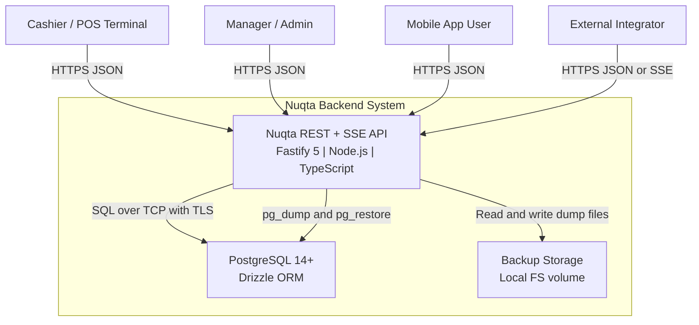
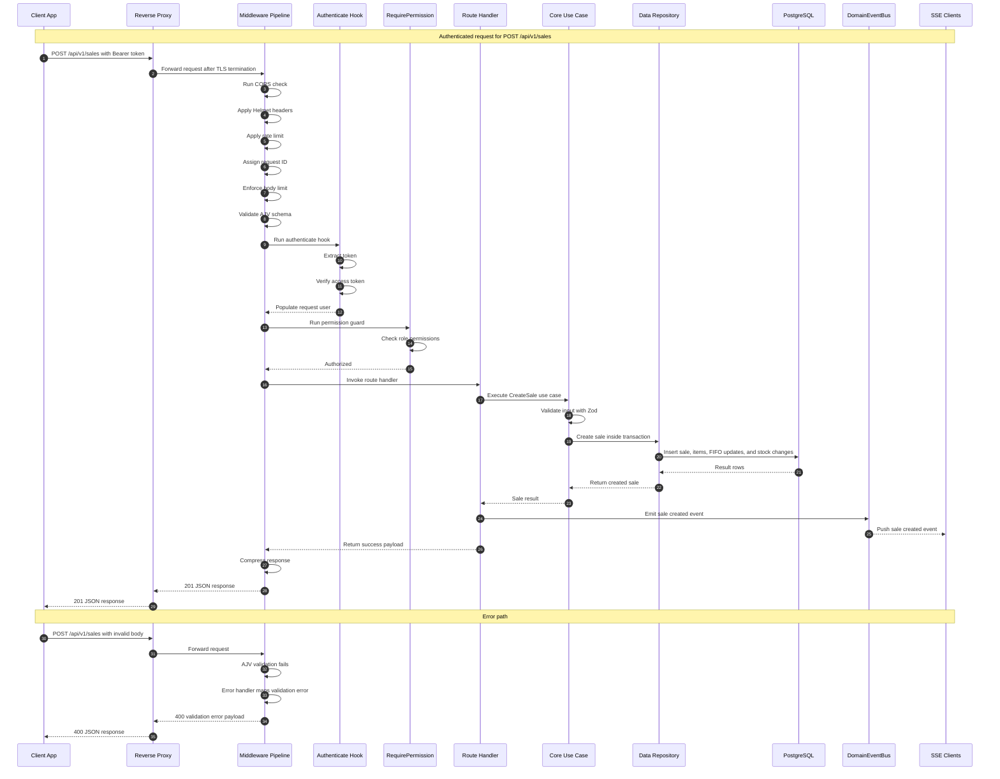
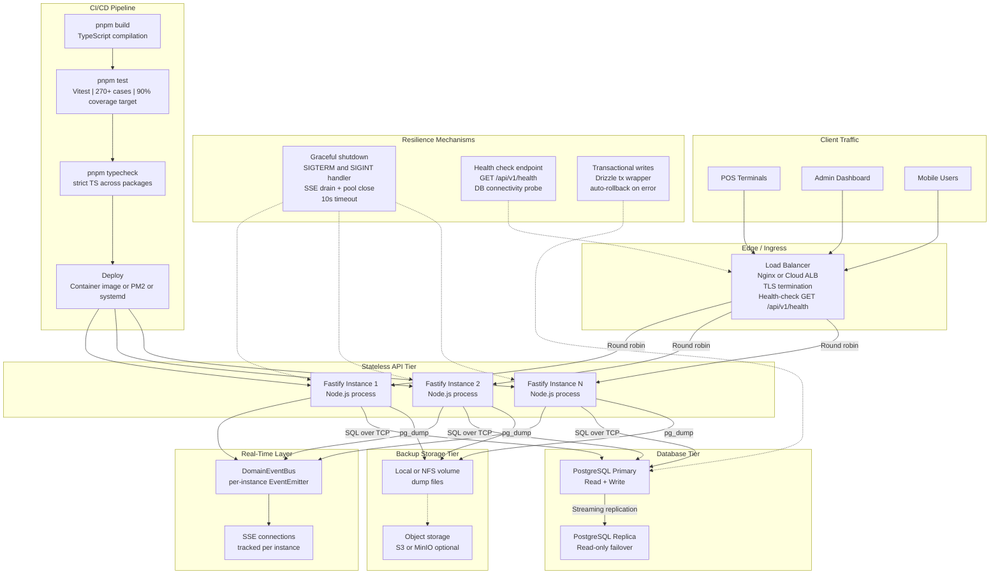

# Nuqta Backend - Architecture Reference

> Generated from the live codebase. Covers system context, internal components,
> request data flow, security posture, and scalability strategy.

---

## 1. System Context

High-level view of actors, the Nuqta system boundary, and external stores.



### Key points

| Aspect       | Detail                                                             |
| ------------ | ------------------------------------------------------------------ |
| **Protocol** | HTTPS (TLS 1.2+) for all clients                                   |
| **Formats**  | JSON request/response; `text/event-stream` for SSE                 |
| **Auth**     | Bearer JWT on every non-public endpoint                            |
| **Database** | PostgreSQL 14+, accessed via Drizzle ORM over `node-postgres` pool |
| **Backups**  | `pg_dump` custom format to local filesystem volume                 |

---

## 2. Component Architecture

Full internal structure: edge -> middleware -> auth -> routes -> domain core -> data layer -> persistence.

```mermaid
flowchart TB
  subgraph EDGE["Edge Layer"]
    LB["Reverse Proxy / LB<br/>Nginx | TLS 1.2+"]
  end

  subgraph MW["Fastify Middleware Pipeline"]
    direction LR
    SWAGGER["aa-swagger<br/>OpenAPI 3.0.3 + Swagger UI"]
    BODYLIMIT["ab-body-limit<br/>Max payload guard"]
    COMPRESS_P["ab-compression<br/>brotli | gzip | deflate"]
    CORS_P["ab-cors<br/>Origin allow-list"]
    HELMET_P["ab-helmet<br/>CSP | X-Frame | HSTS"]
    RATELIMIT_P["ab-rate-limit<br/>100 req/min per IP"]
    REQCTX_P["ac-request-context<br/>Correlation ID | structured logger"]
    LIFECYCLE_P["ad-lifecycle<br/>Graceful shutdown | SSE drain"]
    ERRHANDLER["error-handler<br/>DomainError to envelope"]
    CACHEHDR["cache-headers<br/>ETag | If-None-Match | 304"]
    SENSIBLE["sensible<br/>httpErrors helpers"]
    EVENTBUS_P["event-bus<br/>DomainEventBus decorator"]
    DB_P["db plugin<br/>pg Pool | Drizzle | repos | JwtService"]
    SUPPORT["support<br/>authenticate decorator"]
  end

  subgraph AUTHN["Authentication and Authorization"]
    BEARER["Bearer JWT Verification<br/>Access token | 15 min TTL"]
    RBAC_MW["RBAC preHandler<br/>requirePermission OR logic"]
    PERMSVC["PermissionService<br/>Role to permissions matrix"]
  end

  subgraph ROUTES["API Route Modules /api/v1"]
    direction TB
    R_AUTH["auth, login, register, refresh, me, change-password"]
    R_USERS["users, CRUD, role assignment"]
    R_PRODUCTS["products, CRUD, stock adjust, barcode"]
    R_CATEGORIES["categories, CRUD"]
    R_SALES["sales, create, cancel, refund, receipt"]
    R_PURCHASES["purchases, create, receive, return"]
    R_INVENTORY["inventory, movements, dashboard, reconcile"]
    R_CUSTOMERS["customers, CRUD"]
    R_SUPPLIERS["suppliers, CRUD"]
    R_CUSTLEDGER["customer-ledger, debt tracking, payments"]
    R_SUPLEDGER["supplier-ledger, balance tracking"]
    R_ACCOUNTING["accounting, CoA, journal entries, trial balance, BS, IS"]
    R_POSTING["posting, batch post, unpost, period close"]
    R_HR["hr, employees, payroll runs, approve"]
    R_SETTINGS["settings, company, currency, system, POS, barcode, accounting, modules"]
    R_DASHBOARD["dashboard, aggregated metrics"]
    R_EVENTS["events/stream, SSE real-time push"]
    R_BACKUP["backup, create, list, restore, delete, download"]
    R_AUDIT["audit, activity log queries"]
    R_REPORTS["reports, CSV export"]
    R_POS["pos, POS session settings"]
    R_HEALTH["health, readiness check"]
    R_BARCODE["barcode, templates, print data"]
    R_SYSTEM["system, setup wizard, license"]
  end

  subgraph CORE["@nuqta/core Pure Domain Layer"]
    direction TB
    ENTITIES["Domain Entities<br/>Product, Sale, Purchase, Customer, Supplier, Employee, Account, JournalEntry, PostingBatch, InventoryMovement, User, AuditEvent, Settings, PosSettings, BarcodeTemplate"]
    USECASES["Use Cases<br/>CreateSale, AddPayment, FIFODepletion, GetDashboardStats, ReconcileStock, ChangePassword, CompleteSetupWizard, Settings, Payroll"]
    IFACES["Repository Interfaces<br/>ISaleRepository, IProductRepository, and others"]
    SERVICES["Shared Services<br/>JwtService, PermissionService, FifoDepletionService, SettingsAccessor"]
    ERRORS["Domain Errors<br/>DomainError, toApiError, isDomainError"]
    VALIDATION["Validation<br/>Zod schemas per entity"]
  end

  subgraph DATA["@nuqta/data Persistence Layer"]
    direction TB
    SCHEMA["Drizzle Schema<br/>40+ tables"]
    REPOS["24 repository implementations"]
    TXHELPER["Transaction helper<br/>auto-rollback"]
    MIGRATIONS["SQL migrations<br/>0000 base, 0001 HR, 0002 Settings"]
    SEED["Seed and presets<br/>demo data, chart of accounts"]
    POOL["pg pool connection<br/>DATABASE_URL"]
  end

  subgraph PERSIST["Persistence Stores"]
    PG["PostgreSQL 14+"]
    BKDIR["Backup directory"]
  end

  LB --> MW
  MW --> AUTHN
  AUTHN --> ROUTES
  ROUTES --> USECASES
  USECASES --> IFACES
  IFACES -.-> REPOS
  REPOS --> TXHELPER
  TXHELPER --> POOL
  POOL -->|SQL over TCP| PG

  R_EVENTS --> EVENTBUS_P
  R_PRODUCTS --> EVENTBUS_P
  R_SALES --> EVENTBUS_P
  R_INVENTORY --> EVENTBUS_P
  R_BACKUP --> REPOS
  REPOS -->|pg_dump and pg_restore| PG
  REPOS -->|file IO| BKDIR
  BEARER --> SERVICES
  RBAC_MW --> PERMSVC
  ERRHANDLER -.-> ERRORS
```



### Monorepo package responsibilities

| Package           | Role                                                         | Key dependencies                                      |
| ----------------- | ------------------------------------------------------------ | ----------------------------------------------------- |
| **`@nuqta/core`** | Domain entities, use cases, services, interfaces, errors     | `zod`, `bcryptjs`, `jsonwebtoken`                     |
| **`@nuqta/data`** | Drizzle schema, repository implementations, migrations, seed | `drizzle-orm`, `pg`, `@nuqta/core`                    |
| **Root `src/`**   | Fastify app, plugins, middleware, routes                     | `fastify`, `@fastify/*`, `@nuqta/core`, `@nuqta/data` |

### Plugin load order

Plugins are autoloaded alphabetically by filename prefix:

| Prefix   | Plugin                                                         | Purpose                                    |
| -------- | -------------------------------------------------------------- | ------------------------------------------ |
| `aa-`    | swagger                                                        | OpenAPI 3.0.3 spec + Swagger UI            |
| `ab-`    | body-limit, compression, cors, helmet, rate-limit              | HTTP hardening                             |
| `ac-`    | request-context                                                | Request ID, structured logging             |
| `ad-`    | lifecycle                                                      | Graceful shutdown, SSE connection draining |
| _(none)_ | cache-headers, db, error-handler, event-bus, sensible, support | Core runtime decorators                    |

---

## 3. Data Flow - Request Lifecycle

Sequence diagram showing a typical authenticated write request (sale creation) from
client through every layer to the database and back, including event emission and error path.



### API response envelope

All endpoints return a standardized envelope:

```jsonc
// Success
{ "ok": true, "data": { /* ... */ } }

// Failure
{ "ok": false, "error": { "code": "VALIDATION_ERROR", "message": "...", "details": [] } }
```

### Communication methods

| Channel                     | Protocol / Format          | Use                                      |
| --------------------------- | -------------------------- | ---------------------------------------- |
| Client -> API               | HTTPS + JSON               | All CRUD operations                      |
| API -> Client (push)        | SSE (`text/event-stream`)  | Real-time domain events                  |
| API -> DB                   | TCP (libpq)                | Drizzle queries via `node-postgres` pool |
| API -> Filesystem           | POSIX I/O                  | Backup `.dump` file read/write           |
| API -> pg_dump / pg_restore | Child process (`execFile`) | Database backup / restore                |

---

## 4. Security Layers - Defense in Depth

```mermaid
flowchart LR
  subgraph TRANSPORT["Transport Security"]
    TLS["TLS 1.2+ termination<br/>at reverse proxy"]
    CORS["CORS origin allow-list<br/>credentials true | preflight cache 24h"]
  end

  subgraph HEADERS["HTTP Hardening"]
    HELM["Helmet<br/>CSP | X-Frame-Options | X-Content-Type-Options | Strict-Transport-Security"]
    RL["Rate limiting<br/>100 req/min per IP<br/>localhost allow-listed<br/>Retry-After header"]
    BL["Body limit<br/>Max payload size guard"]
  end

  subgraph AUTHN["Authentication"]
    JWT["JWT bearer tokens<br/>HS256 | HMAC-SHA256"]
    ACC["Access token<br/>15 min TTL"]
    REF["Refresh token<br/>7 day TTL"]
    BCRYPT["Password storage<br/>bcryptjs hash + salt"]
  end

  subgraph AUTHZ["Authorization"]
    RBAC["Role based access control<br/>Admin | Manager | Cashier"]
    PERM["PermissionService<br/>Role to permissions mapping"]
    PRE["requirePermission preHandler<br/>OR logic across permissions"]
  end

  subgraph DATAPROTECT["Data Protection"]
    ENVVARS["Secrets via env vars<br/>JWT_SECRET | DATABASE_URL"]
    SAFENAME["Backup name sanitization<br/>regex allowlist | no path traversal"]
    PARAMVAL["Input validation<br/>AJV schema + Zod domain validation"]
    AUDIT["Audit log<br/>User | IP | action | timestamp"]
  end

  subgraph OBSERVABILITY["Security Observability"]
    REQID["Correlation ID per request"]
    STRUCTLOG["Structured JSON logs<br/>userId | IP | duration | statusCode"]
    ERRLOG["Error classification<br/>4xx warn | 5xx error"]
  end

  TLS --> CORS
  CORS --> HELM
  HELM --> RL
  RL --> BL
  BL --> JWT
  JWT --> ACC
  JWT --> REF
  JWT --> BCRYPT
  ACC --> RBAC
  RBAC --> PERM
  PERM --> PRE
  PRE --> PARAMVAL
  PARAMVAL --> SAFENAME
  SAFENAME --> ENVVARS
  PARAMVAL --> AUDIT
  AUDIT --> REQID
  REQID --> STRUCTLOG
  STRUCTLOG --> ERRLOG
```



### Security summary

| Layer                  | Mechanism                                | Implementation                              |
| ---------------------- | ---------------------------------------- | ------------------------------------------- |
| **Transport**          | TLS 1.2+                                 | Terminated at reverse proxy / LB            |
| **CORS**               | Origin allow-list                        | `@fastify/cors` with `CORS_ORIGIN`          |
| **HTTP hardening**     | CSP, X-Frame, HSTS                       | `@fastify/helmet`                           |
| **Rate limiting**      | 100 req/min/IP                           | `@fastify/rate-limit`                       |
| **Authentication**     | JWT (access 15 min + refresh 7 d)        | `JwtService` in `@nuqta/core`               |
| **Password storage**   | bcrypt hash + salt                       | `bcryptjs`                                  |
| **Authorization**      | RBAC (Admin/Manager/Cashier)             | `PermissionService` + `requirePermission()` |
| **Input validation**   | Two-stage: AJV + Zod                     | Fastify route schema + use-case validation  |
| **Backup safety**      | Filename regex allowlist                 | `BackupRepository.assertSafeName()`         |
| **Secrets management** | Environment variables only               | `JWT_SECRET`, `DATABASE_URL`                |
| **Audit trail**        | Comprehensive activity logging           | `AuditRepository`                           |
| **Observability**      | Structured JSON logs with correlation ID | `ac-request-context` plugin                 |

---

## 5. Scalability, Redundancy and Deployment



### Scalability characteristics

| Dimension             | Current design                                             | Growth path                                                                         |
| --------------------- | ---------------------------------------------------------- | ----------------------------------------------------------------------------------- |
| **API tier**          | Stateless Fastify processes                                | Horizontal scale behind LB; zero shared in-memory state                             |
| **Database**          | Single PostgreSQL with connection pooling                  | Read replicas + streaming replication for HA; PgBouncer for connection multiplexing |
| **Real-time (SSE)**   | In-process `EventEmitter` per instance                     | Introduce Redis Pub/Sub or PostgreSQL `LISTEN/NOTIFY` for multi-instance fan-out    |
| **Backups**           | Local filesystem via `pg_dump`                             | Replicate to object storage such as S3 or MinIO                                     |
| **Graceful shutdown** | SIGTERM/SIGINT handler, 10s timeout, SSE drain, pool close | Zero-downtime deploys with LB health-check draining                                 |
| **CI/CD**             | `pnpm build` -> `pnpm test` -> `pnpm typecheck`            | Container image -> registry -> rolling deploy                                       |

---

## 6. Technology Stack Summary

| Layer               | Technology                       | Version / Notes                   |
| ------------------- | -------------------------------- | --------------------------------- |
| **Runtime**         | Node.js + TypeScript             | TS 5.x, ESM modules               |
| **Web framework**   | Fastify                          | 5.x + fastify-cli                 |
| **Validation**      | Zod (domain) + AJV (HTTP schema) | Zod 4.x                           |
| **ORM**             | Drizzle ORM                      | 0.45+ with `node-postgres` driver |
| **Database**        | PostgreSQL                       | 14+                               |
| **Auth**            | jsonwebtoken + bcryptjs          | JWT HS256                         |
| **API docs**        | `@fastify/swagger` + swagger-ui  | OpenAPI 3.0.3                     |
| **Testing**         | Vitest                           | 4.x, 270+ test cases              |
| **Package manager** | pnpm                             | 10.x workspaces                   |
| **Reverse proxy**   | Nginx (or cloud ALB)             | TLS termination                   |

---

## 7. Integration Points

| Integration                | Direction                | Mechanism                                       |
| -------------------------- | ------------------------ | ----------------------------------------------- |
| **OpenAPI consumers**      | Outbound (spec served)   | `/docs` Swagger UI; raw spec at `/docs/json`    |
| **PostgreSQL CLI tools**   | Outbound (child process) | `pg_dump` / `pg_restore` via `execFile`         |
| **SSE event consumers**    | Outbound (push)          | `text/event-stream` at `/api/v1/events/stream`  |
| **Future: Redis**          | Not yet wired            | Placeholder for token blacklist and SSE fan-out |
| **Future: Object storage** | Outbound                 | Backup replication to S3 or MinIO               |
